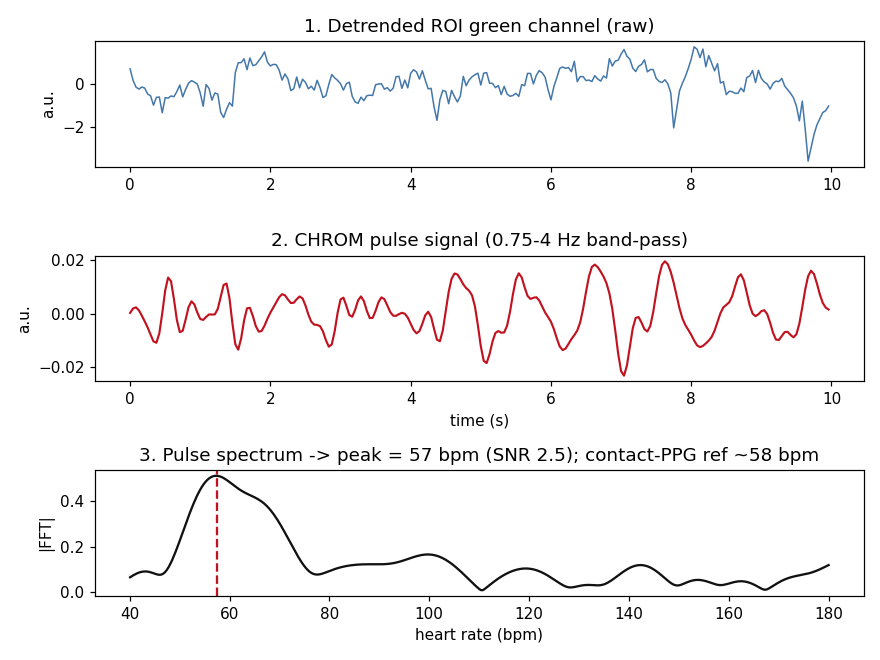

# Contactless Vital Signs Monitor (Webcam rPPG)

Estimate **heart rate** and **breathing rate** from an ordinary webcam — no wearable, no
extra hardware — using **remote photoplethysmography (rPPG)**. A face is tracked with
MediaPipe, the forehead/cheek skin colour is averaged per frame, and the tiny pulsatile
signal is recovered with the **CHROM** algorithm, Butterworth band-pass filtering, and
FFT-based frequency estimation. A live Streamlit dashboard shows the camera feed with the
ROI overlay, the pulse waveform, current HR/RR, and a signal-quality indicator.



*Raw ROI green looks like noise (top); CHROM recovers a clear pulse (middle); the spectral
peak gives the heart rate (bottom) — here 57 bpm vs a ~58 bpm contact-PPG reference.*

## Quick start

Requires **Python 3.10+**. On Windows (PowerShell):

```powershell
python -m venv venv
.\venv\Scripts\Activate.ps1
pip install -r requirements.txt
python run.py
```

On macOS/Linux use `python3 -m venv venv && source venv/bin/activate`. `python run.py`
launches the dashboard in your browser; pick **Webcam** as the source and press **Start**.
The face-landmark model (~4 MB) is downloaded automatically on first run.

No webcam? Run against a video file instead — choose **Video file** in the sidebar and
point it at any face video (see [Dataset](#dataset-for-validation) to fetch sample clips).

## How it works

```
Webcam -> Face Mesh -> forehead/cheek ROI -> mean RGB per frame
       -> rolling buffer -> detrend + CHROM -> band-pass 0.75-4 Hz -> FFT -> Heart rate
       -> low-freq 0.1-0.5 Hz path -> Breathing rate
       -> spectral-SNR + motion -> Signal-quality gate -> Streamlit dashboard
```

Full explanation of the CHROM method, the filter/FFT parameter choices, and the module
map is in **[docs/architecture.md](docs/architecture.md)**.

## Validation

The pipeline was validated on 5 subjects from the **MCD-rPPG** dataset (resting webcam
recordings with synchronized contact-PPG ground truth). Estimated heart rate was compared,
window by window, against a **time-aligned reference computed from the contact-PPG
waveform**. Measured results:

| Window set | N | MAE (bpm) | RMSE (bpm) | Pearson r |
|---|--:|--:|--:|--:|
| All windows | 55 | 11.9 | 23.1 | -0.02 |
| Usable (SNR ≥ 0.7) | 18 | 6.9 | 12.9 | -0.14 |
| **Clean (SNR ≥ 1.5)** | 5 | **2.3** | 3.9 | **0.79** |

On clean windows the rPPG heart rate tracks contact PPG to within ~2 bpm; the error falls
monotonically as the signal-quality gate tightens. The all-window figures are inflated by a
minority of windows with harmonic-doubling errors. Breathing rate is validated primarily by
synthetic unit tests (no respiration waveform exists in the dataset). Full methodology,
figures, and honest limitations (lighting, motion, skin-tone, compression) are in
**[validation/validation_report.md](validation/validation_report.md)**.

Reproduce it:

```powershell
pip install -r requirements-dev.txt
python validation/download_mcd.py          # ~250 MB into data/ (git-ignored)
python validation/run_validation.py        # writes CSV, figure, and report
```

## Tests

All signal-processing logic is covered by synthetic-signal unit tests (known frequencies in,
recovered rates out):

```powershell
pytest
```

## Dataset (for validation)

Development and validation use the **MCD-rPPG** dataset (Yegorov et al., 2025), hosted on
the Hugging Face Hub. `validation/download_mcd.py` fetches a fixed 5-subject subset
(front-facing `FullHDwebcam` resting recordings + synchronized PPG) into `data/`, which is
**git-ignored** — the dataset is never committed. See the script for details and citation.

> The project originally targeted UBFC-rPPG; its Google Drive mirror was download-quota
> blocked, so MCD-rPPG (reliably HF-hosted, and with both HR and RR references) is used
> instead.

## Repository layout

```
src/            capture, face_roi, signal_pipeline, breathing, quality, dashboard
tests/          synthetic-signal unit tests (pytest)
validation/     dataset downloader, validation harness, report + figure
docs/           architecture notes + pipeline figure
run.py          launches the Streamlit dashboard
```

## Limitations

This is a portfolio/research project, **not a medical device**. RGB-camera rPPG is sensitive
to lighting and motion, and is documented in the literature to be less reliable for darker
skin tones; no clinical-accuracy or fairness claims are made. See the validation report for
the full discussion.

## Future work — toward radar-based contactless monitoring

This project demonstrates the core contactless-vitals skill set — skin-ROI extraction,
temporal filtering, and frequency-domain vital-sign recovery — on an RGB camera. The same
signal-processing backbone (band-pass + FFT + quality gating) carries directly to
**radar-based sensing**, which is robust to lighting and works through the dark and through
clothing. A companion project, **radar-vitals-sim**, simulates CW/FMCW radar returns from a
moving chest wall and recovers breathing rate via I/Q demodulation and FFT — the natural
next step from optical rPPG toward the kind of radar contactless health monitoring used in
elderly-care research.

## Acknowledgements

- **CHROM** algorithm: G. de Haan & V. Jeanne, "Robust Pulse Rate From Chrominance-Based
  rPPG", *IEEE Transactions on Biomedical Engineering*, 2013.
- **MCD-rPPG** dataset: K. Yegorov et al., "Gaze into the Heart: A Multi-View Video Dataset
  for rPPG and Health Biomarkers Estimation", 2025 (arXiv:2508.17924).
- **MediaPipe Face Landmarker** for face-mesh landmarks.
```
