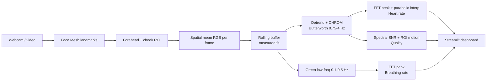

# Architecture

## Pipeline

```
Webcam / video file  (src/capture.py: WebcamCapture)
   -> Face Mesh landmarks           (src/face_roi.py: MediaPipe FaceLandmarker)
      -> ROI selection              forehead + cheeks convex hulls (avoid eyes/mouth)
         -> spatial mean RGB        one [R,G,B] per frame
            -> rolling buffer        (src/signal_pipeline.py: SignalBuffer, measured fs)
               -> detrend + CHROM    RGB -> single pulse signal (Butterworth 0.75-4 Hz)
                  -> FFT peak        Hann + zero-pad + parabolic interp -> HR (bpm)
               -> low-freq path      green channel, 0.1-0.5 Hz -> RR (breaths/min)
                  -> quality gate    (src/quality.py: spectral SNR + ROI motion)
                     -> dashboard    (src/dashboard.py: Streamlit UI)
```



## Why CHROM?

A naive rPPG signal is the mean green channel of a skin patch: haemoglobin absorbs green
light, so the skin brightness fluctuates slightly (~1%) with each heartbeat. But that raw
signal is dominated by illumination drift and, especially, by **motion** — any movement
changes the amount and angle of light reaching the camera far more than the pulse does.

**CHROM** (de Haan & Jeanne, *IEEE TBME*, 2013) suppresses the motion/specular component
by working in a chrominance space. Each channel is first divided by its temporal mean, then
two projections are formed:

```
Xs = 3*Rn - 2*Gn
Ys = 1.5*Rn + Gn - 1.5*Bn
```

These coefficients are chosen so that, under a standardised skin-tone assumption, the
specular reflection (which is white/grey and therefore equal across channels) cancels,
while the pulsatile blood-volume component survives. `Xs` and `Ys` are band-pass filtered
to the heart-rate band and combined:

```
S = Xf - alpha * Yf,   alpha = std(Xf) / std(Yf)
```

The `alpha` scaling equalises the two projections' amplitudes so that any residual motion,
which appears with the same sign in both, cancels in the subtraction — leaving a cleaner
pulse `S` than the green channel alone. See `docs/pipeline_demo.png` for a worked example
where the raw green channel looks like noise but the CHROM pulse shows a clear ~1 Hz beat.

(POS, Wang et al. 2017, is a closely related alternative projection; CHROM is used here as
it is the method named in the project brief and is simple and robust for this scope.)

## Frequency estimation

Heart rate is the dominant spectral peak of `S` within 0.75–4 Hz (45–240 bpm):

* A **Hann window** reduces spectral leakage from the finite analysis window.
* The spectrum is **zero-padded** to ≥ 4× length so that
* **parabolic interpolation** around the peak bin recovers the frequency to sub-bin
  (< 1 bpm) accuracy without needing a longer, more laggy window.

The live window is 10 s (responsive; ~7–12 beats). Breathing rate uses the same estimator
on the 0.1–0.5 Hz band over a longer 30 s window, since a full breath is much slower.

## Signal quality

Two metrics gate the estimates (see `src/quality.py`):

* **Spectral SNR** — power within ±0.2 Hz of the peak divided by the rest of the in-band
  power. A clean pulse gives a large value; noise gives a small one.
* **ROI motion** — mean frame-to-frame displacement of the ROI centroid (px/frame).

Validation on MCD-rPPG showed the rPPG heart rate matches contact PPG closely when SNR is
high and scatters when it is low, so this gate is what makes reported numbers trustworthy.

## Module map

| File | Responsibility |
|---|---|
| `src/capture.py` | `WebcamCapture`: frames + timestamps from a webcam index or video file |
| `src/face_roi.py` | `FaceROIExtractor` (MediaPipe Tasks), ROI polygons, `mean_rgb_in_polygon` |
| `src/signal_pipeline.py` | `SignalBuffer`, detrend, Butterworth band-pass, CHROM, FFT rate estimation |
| `src/breathing.py` | `estimate_breathing_rate` (low-frequency path) |
| `src/quality.py` | spectral-SNR + motion metrics, good/fair/poor assessment |
| `src/dashboard.py` | `VitalsMonitor` engine + Streamlit UI |
| `run.py` | launches the Streamlit dashboard |
| `validation/` | dataset download + validation harness + report |
```
