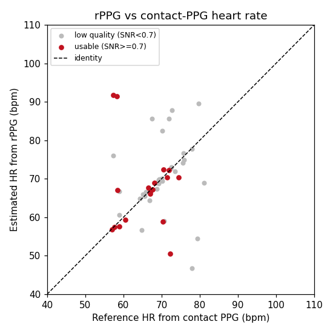

# Validation Report — rPPG Vitals

## Methodology

The pipeline was validated on **5 subjects** from the MCD-rPPG dataset (front-facing `FullHDwebcam`, resting/`before` recordings), processing the first **60 s** of each video.

* **Heart rate** is estimated from each 10 s window (5 s hop) with the CHROM algorithm + Butterworth band-pass (0.75–4 Hz) + FFT peak detection.
* The **reference** for each window is computed from the subject's synchronized contact-PPG waveform (`ppg_sync`, one sample per video frame) with the *same* FFT estimator — a fully time-aligned, apples-to-apples comparison.
* Windows are graded by spectral SNR; `usable` = SNR ≥ 0.7, `clean` = SNR ≥ 1.5. This mirrors the dashboard's quality gate.

> **Why not the `db.csv` `pulse` value?** That column is a single spot measurement taken at another moment; it does not match the heart rate present in the video (verified during development), so it is unsuitable as a per-window reference. The contact-PPG waveform is used instead.

## Heart-rate results (rPPG vs contact PPG)

| Window set | N | MAE (bpm) | RMSE (bpm) | Pearson r |
|---|--:|--:|--:|--:|
| All windows | 55 | 11.92 | 23.11 | -0.02 |
| Usable (SNR ≥ 0.7) | 18 | 6.86 | 12.87 | -0.14 |
| Clean (SNR ≥ 1.5) | 5 | 2.34 | 3.88 | 0.79 |

Usable-window coverage: **33%** of windows (18/55).

**Interpretation (honest):** the error falls monotonically as the SNR gate tightens — from 11.9 bpm over all windows to 2.3 bpm on clean windows (SNR ≥ 1.5, Pearson r = 0.79), where the rPPG heart rate tracks contact PPG to within a couple of bpm. The all-window RMSE (23 bpm) and near-zero correlation are inflated by a minority of windows with harmonic-doubling errors (estimate ≈ 2× the true rate). Note the SNR gate is deliberately conservative: several sub-threshold windows are in fact accurate, so the gate trades recall for precision rather than perfectly separating good from bad. On this near-static, compressed dataset only a small fraction of windows reach the clean tier; better lighting and uncompressed capture would raise that fraction.

## Breathing-rate results

Per-subject breathing rate vs the `db.csv` `respiratory` scalar: **MAE = 8.3 breaths/min** across 5 subjects.

This is an approximate check only. The dataset provides **no respiration waveform**, so the reference is a single clinical spot value, and the low-frequency ROI signal is intrinsically noisier than the pulse. Breathing-rate correctness is therefore established mainly by the synthetic-signal unit tests (`tests/test_breathing.py`), with this real-data comparison as supporting evidence.

## Known limitations

* **Signal quality dominates.** Dim/uneven lighting, low skin exposure, and motion all degrade the pulse; the SNR gate flags these but cannot recover them.
* **Motion sensitivity.** Frame-to-frame ROI movement injects broadband noise; the recordings used here are near-static, so real-world handheld/live use will be harder.
* **Skin tone.** RGB-camera rPPG is documented in the literature to be less reliable for darker skin tones (lower green-channel pulsatile contrast). This small subset does not span that range and no fairness claim is made.
* **Compression.** The dataset videos are compressed (MPEG-4) with occasional decode artifacts; uncompressed capture would improve SNR.
* **Not a medical device.** These are engineering estimates, not clinical measurements.

_Generated by `validation/run_validation.py` from 55 heart-rate windows across 5 subjects._